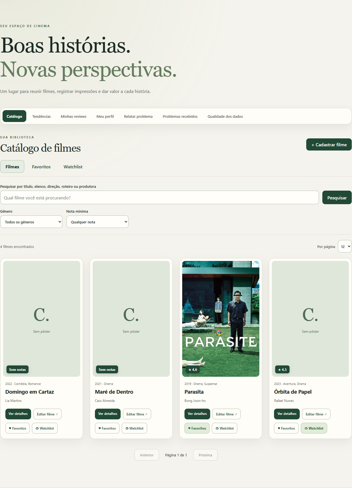
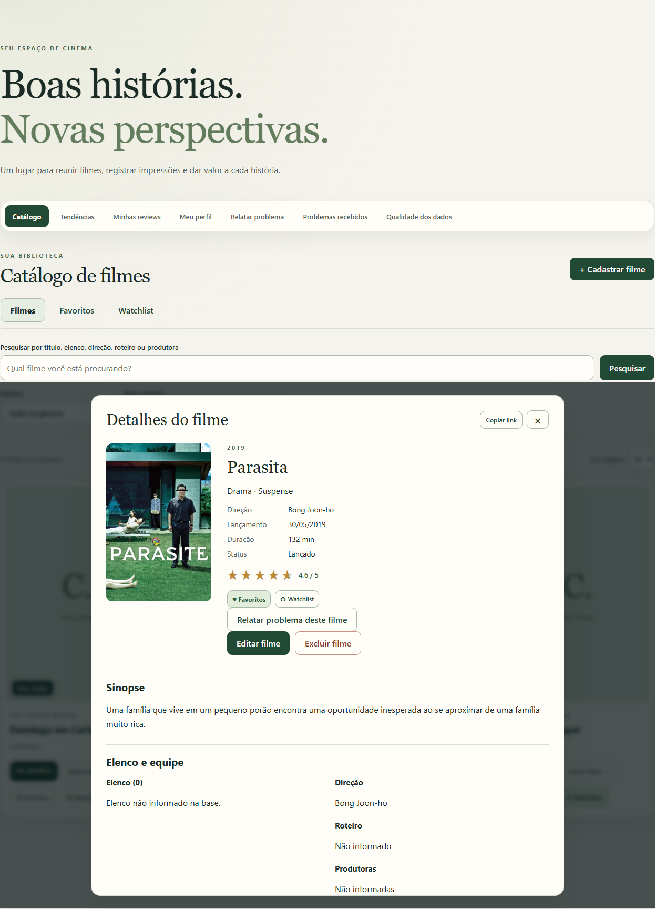
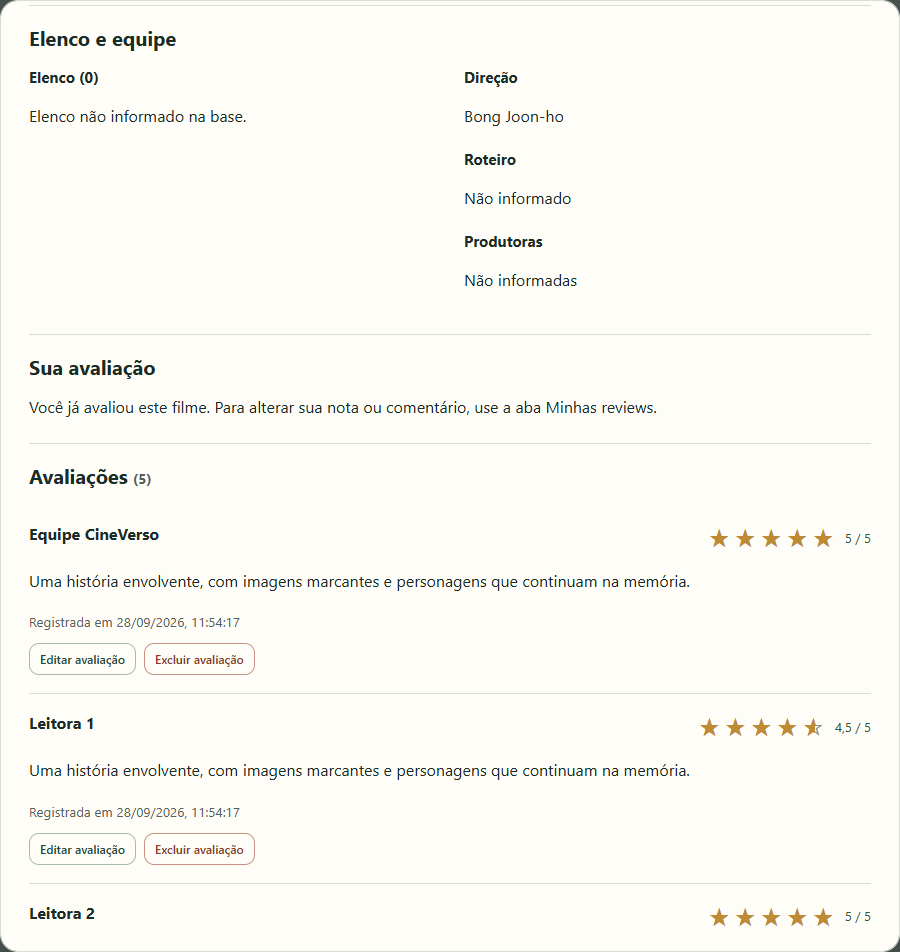
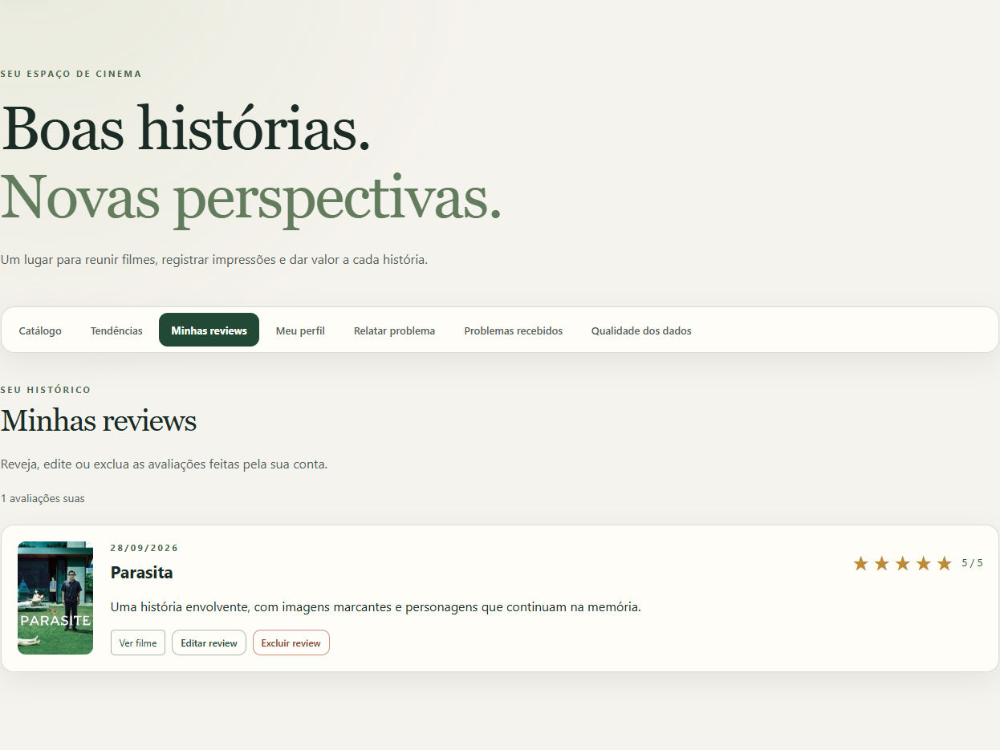
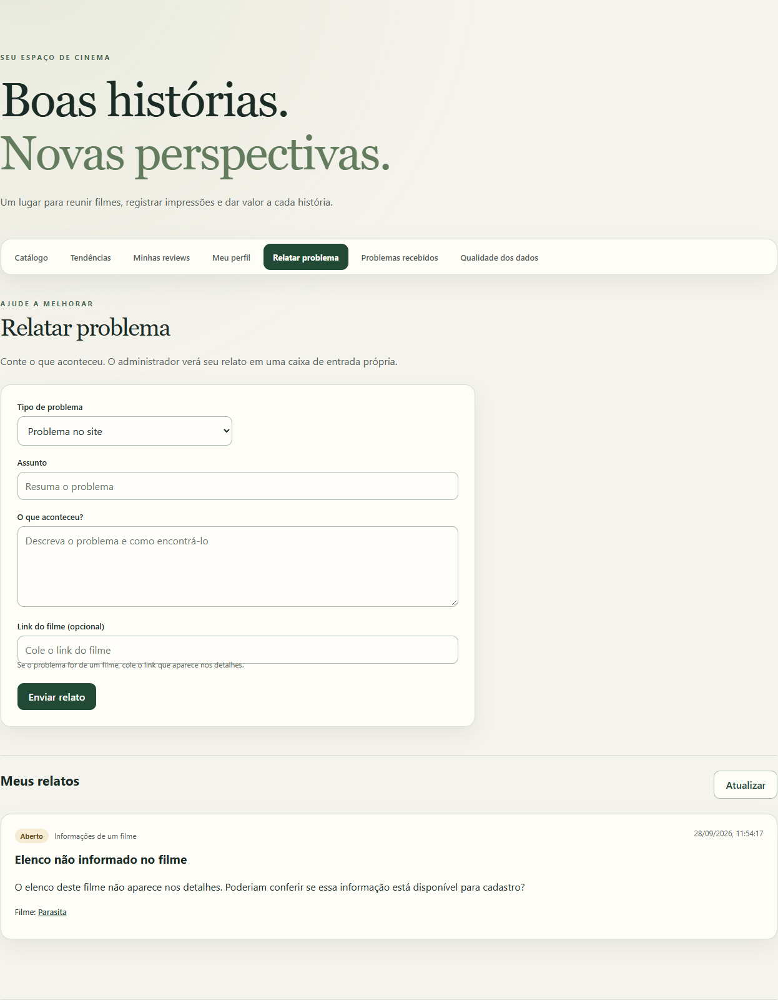
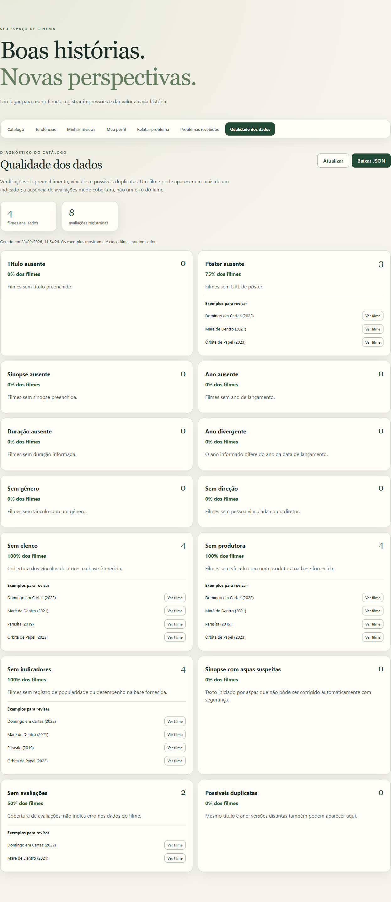

# CineVerso

Sistema de avaliação de filmes desenvolvido para a atividade Rocket Lab 2026.2. O administrador gerencia o catálogo; cada pessoa tem suas próprias listas e pode publicar avaliações. A interface React consome uma API FastAPI; os dados ficam em SQLite.

**Comece por aqui:** requisitos e instalação · [iniciar a aplicação](#configurar-e-iniciar-o-backend) · [criar o administrador](#criar-o-administrador-inicial) · [testes](#verificações-de-desenvolvimento) · [portas e conexão local](#configurar-e-iniciar-o-frontend).

## Visão geral

O **CineVerso** é uma aplicação web para explorar um catálogo de filmes, organizar o que cada pessoa quer assistir e registrar opiniões. A experiência combina um catálogo pesquisável com páginas de detalhes, avaliações da comunidade e ferramentas de administração. O sistema foi desenvolvido para a atividade Rocket Lab 2026.2 com React, TypeScript, FastAPI e SQLite.

Há dois perfis de uso:

- **Pessoa usuária:** cria uma conta, pesquisa e filtra filmes, monta listas pessoais de Favoritos e Watchlist, publica uma avaliação por filme, acompanha e edita suas reviews, atualiza seu perfil e envia relatos de problemas.
- **Administrador:** além das funções anteriores, cadastra, edita e exclui filmes; gerencia avaliações; acompanha e atualiza relatos recebidos; consulta indicadores de qualidade e exemplos de registros para revisão.

O catálogo pode começar vazio ou receber os CSVs da atividade. Quando os dados estão disponíveis, os detalhes podem apresentar elenco, equipe, produtoras e indicadores de desempenho importados. O resumo agregado de notas fornecido pela atividade aparece separado da lista de avaliações individuais. Essa lista pode reunir reviews dos CSVs e reviews publicadas no CineVerso; Favoritos, Watchlist e **Minhas reviews** continuam separados por conta.

## Conheça as abas

As imagens abaixo mostram os principais fluxos da aplicação. Os filmes e as avaliações nas capturas são dados demonstrativos criados para documentar as telas; a base importada da atividade não é necessária para visualizar o exemplo.

### Catálogo

Pesquise por título, elenco, direção, roteiro ou produtora. Combine a pesquisa com filtros de gênero e nota mínima e percorra os resultados paginados. Os cartões abrem os detalhes do filme e permitem adicionar ou remover itens das listas pessoais. O administrador também tem acesso aos comandos para cadastrar e editar filmes.



### Detalhes do filme e avaliações

Cada filme tem uma ficha com sinopse, ano, duração, gênero, equipe e média das avaliações individuais armazenadas no sistema. A ficha também reúne o histórico paginado de reviews, que pode incluir registros dos CSVs e avaliações publicadas no CineVerso, permite publicar uma nota de uma a cinco estrelas (incluindo meias estrelas) e comentar. A pessoa autora pode editar ou excluir sua própria avaliação; o administrador pode moderar as avaliações. O link do filme pode ser copiado e aberto diretamente. O resumo agregado importado é apresentado em separado.





### Tendências

Explore rankings por popularidade dos dados importados, quantidade de avaliações individuais e melhor média. A quantidade e a média consideram os registros de `movie_reviews`, que incluem avaliações importadas e publicadas no CineVerso. O ranking de melhor média requer pelo menos cinco registros nessa tabela; não são necessariamente cinco avaliações de contas do site.


### Minhas reviews

Reúna as avaliações que a conta publicou no site. A partir dessa lista, é possível abrir o filme, editar o comentário ou a nota, ou excluir a review. Avaliações importadas dos CSVs não pertencem a uma conta e, por isso, não aparecem nesta aba.



### Meu perfil

Atualize o nome de exibição e escolha uma foto de perfil. O nome e o avatar são usados no cabeçalho e associados à conta.


### Relatar problema

Envie um relato sobre o site ou sobre um filme, com assunto e descrição. É possível incluir o link do filme; relatos enviados aparecem abaixo do formulário com seu status para que a pessoa acompanhe o andamento.



### Problemas recebidos — administrador

O administrador consulta os relatos enviados, filtra por abertos, todos ou resolvidos e marca cada item como resolvido ou reabre quando necessário. O envio é registrado no próprio sistema; não há envio de email.


### Qualidade dos dados — administrador

Confira contagens e percentuais de campos ausentes, vínculos incompletos, anos divergentes, possíveis duplicatas e filmes sem avaliações. Cada indicador pode trazer exemplos para inspeção manual, e o relatório pode ser atualizado ou baixado em JSON. Os apontamentos apoiam a revisão: não alteram os filmes automaticamente.



## Funcionalidades

- Catálogo paginado, pesquisa por título, elenco, direção, roteiro ou produtora, filtros por gênero e nota mínima, e detalhes dos filmes.
- Pesquisa sem diferenciar maiúsculas ou acentos, incluindo nomes em português.
- Detalhes com elenco, equipe, produtoras, notas TMDB/IMDb, popularidade, orçamento e receita quando disponíveis nos CSVs.
- Contas individuais com cadastro, login e logout; Favoritos e Watchlist separados por conta.
- Interface responsiva com tema claro e escuro, preferência do sistema e escolha salva no navegador.
- Aba de tendências com rankings por popularidade, quantidade de avaliações e média de notas.
- Cadastro, edição e exclusão de filmes, com confirmação antes da exclusão.
- Histórico paginado de avaliações, notas visuais de 1 a 5 estrelas em passos de meia estrela, edição e exclusão de avaliações e média calculada a partir das avaliações salvas.
- Links próprios para cada filme, com abertura direta por `/filmes/{movie_id}` e navegação pelo histórico do navegador.
- Rascunhos locais para cadastro e edição de filmes e avaliações, separados por conta e recuperados ao reabrir o formulário.
- Aba **Minhas reviews** com histórico paginado, edição e exclusão das avaliações da conta.
- Aba **Relatar problema** com acompanhamento do status e caixa **Problemas recebidos** para o administrador resolver ou reabrir relatos.
- Relatório de qualidade dos dados com contagens, percentuais, exemplos para revisão e download em JSON.
- Estados de carregamento, erro, lista vazia e filme não encontrado.
- Importação dos CSVs fornecidos pela atividade.

## Tecnologias e pré-requisitos

| Camada | Tecnologias | Necessário para executar |
|---|---|---|
| Frontend | React, TypeScript, Vite | Node.js 22.12+ na linha 22, 24.x ou 26+, e npm |
| Backend | Python, FastAPI, SQLAlchemy, Alembic | Python 3.11 ou superior |
| Banco | SQLite | Incluído no Python; não requer servidor próprio |

Instale também o Git para clonar o repositório. Os comandos abaixo usam **Windows PowerShell**. Execute os comandos de backend dentro de `backend/`: o caminho padrão do banco é relativo a essa pasta.

## Clonar o projeto

```powershell
git clone https://github.com/Arturvpf/rocketlab-movie-reviews.git
cd rocketlab-movie-reviews
```

## Configurar e iniciar o backend

No primeiro terminal, a partir da raiz do projeto:

```powershell
cd backend
python -m venv .venv
.\.venv\Scripts\python -m pip install -r requirements.lock
.\.venv\Scripts\python -m pip install --no-deps -e .
if (-not (Test-Path .env)) { Copy-Item .env.example .env }
.\.venv\Scripts\python -m alembic upgrade head
```

O Alembic cria as tabelas antes de iniciar a aplicação. Sem a importação dos CSVs, o catálogo começa vazio e o administrador pode cadastrar filmes pela interface. O arquivo `backend/.env` define `DATABASE_URL` e `BACKEND_CORS_ORIGINS`; o padrão cria `backend/rocketlab.db` e permite o frontend em `http://localhost:5173`.

`backend/requirements.lock` fixa as versões do backend, das ferramentas de desenvolvimento e das dependências transitivas. Ao alterar as dependências em `pyproject.toml`, atualize o lock intencionalmente com `pip-tools`:

```powershell
python -m pip install pip-tools==7.6.1
pip-compile --strip-extras --extra dev --output-file requirements.lock pyproject.toml
```

### Criar o administrador inicial

Depois de aplicar a migration, execute em `backend/`:

```powershell
.\.venv\Scripts\python -m app.auth.create_admin
```

Informe email, nome e senha de pelo menos 12 caracteres. A senha é lida sem aparecer no terminal. Esta conta administra filmes e acessa o relatório de qualidade. Contas criadas pela página de cadastro são contas comuns. Ao migrar uma instalação existente, o comando atribui ao primeiro administrador as entradas antigas de Favoritos e Watchlist; as avaliações importadas continuam sem proprietário e só o administrador pode editá-las ou excluí-las.

### Importar os dados iniciais

Obtenha com os materiais da atividade os arquivos **`bases-1.zip`** e **`bases-2.zip`**. Eles não estão no GitHub. Coloque ambos na pasta `Downloads` do seu usuário ou ajuste os caminhos no comando. Depois de aplicar a migration, execute em `backend/`:

```powershell
.\.venv\Scripts\python -m app.import_csv "$env:USERPROFILE\Downloads\bases-1.zip" "$env:USERPROFILE\Downloads\bases-2.zip"
```

O importador lê os dez CSVs diretamente dos ZIPs, sem extração. Aguarde a mensagem `Importação concluída e confirmada.`; a carga completa pode levar alguns minutos. Se preferir, passe os caminhos de dois diretórios com os CSVs extraídos. A carga ocorre em uma transação e verifica as chaves estrangeiras. Repetir o comando preserva registros e campos editados que ainda existem, mas pode recriar dados do CSV que tenham sido excluídos depois da carga. Também pode restaurar vínculos de gêneros ou diretores removidos localmente caso continuem presentes nos arquivos de origem.

Se os arquivos já estiverem extraídos, execute em `backend/` e informe os caminhos das duas pastas:

```powershell
$bases1 = Read-Host "Caminho da pasta com os CSVs da bases-1"
$bases2 = Read-Host "Caminho da pasta com os CSVs da bases-2"
.\.venv\Scripts\python -m app.import_csv $bases1 $bases2
```

Na primeira pasta devem estar `dim_people.csv`, `dim_reviews.csv`, `dim_companies.csv`, `dim_genres.csv` e `dim_movies.csv`. Na segunda, `movies_reviews.csv`, `bridge_movie_person.csv`, `fact_movies_performance.csv`, `bridge_movie_company.csv` e `bridge_movie_genre.csv`.

Os arquivos fornecidos nesta atividade contêm 95.645 filmes e 43.666 avaliações individuais. O banco local e os ZIPs não são versionados neste repositório. Evite alterar filmes pela API enquanto a importação estiver em andamento, pois a transação ocupa a escrita do SQLite.

Depois da importação, ou logo após a migration se você quiser começar com um catálogo vazio, inicie a API no mesmo terminal, ainda em `backend/`:

```powershell
.\.venv\Scripts\python -m uvicorn app.main:app --reload --host 127.0.0.1 --port 8000
```

## Configurar e iniciar o frontend

Em **outro terminal**, a partir da raiz do projeto:

```powershell
cd frontend
npm ci
if (-not (Test-Path .env)) { Copy-Item .env.example .env }
npm run dev
```

`VITE_API_URL` em `frontend/.env` deve apontar para a URL raiz do backend, sem `/api/v1`; o valor padrão é `http://localhost:8000`. Se mudar a origem ou porta do frontend, atualize também `BACKEND_CORS_ORIGINS` em `backend/.env` e reinicie os servidores. A porta de desenvolvimento do Vite é 5173.

Os comandos de configuração preservam um `.env` existente. Confira os valores abaixo se você já executou o projeto antes:

```dotenv
# frontend/.env
VITE_API_URL=http://localhost:8000

# backend/.env
BACKEND_CORS_ORIGINS=["http://localhost:5173"]
```

Abra o frontend por **`http://localhost:5173`** e mantenha **`localhost`** também na URL da API. Não misture `localhost` no navegador com `127.0.0.1` em `VITE_API_URL`: são hosts diferentes para os cookies, e a sessão usa `SameSite=Lax`. Permitir ambos no CORS, por si só, não resolve essa diferença.

O `--host 127.0.0.1` do Uvicorn é o endereço IPv4 em que o servidor escuta; não obriga o navegador a usar esse nome na URL. O acesso documentado continua sendo `http://localhost:8000`. Se sua máquina resolver `localhost` apenas para IPv6 (`::1`), ajuste a resolução ou use `127.0.0.1` consistentemente: inicie o Uvicorn com `--host 127.0.0.1`, inicie o Vite com `npm run dev -- --host 127.0.0.1`, abra `http://127.0.0.1:5173`, configure `VITE_API_URL=http://127.0.0.1:8000` e permita `http://127.0.0.1:5173` no CORS.

O Vite usa `strictPort: true`: se a porta 5173 estiver ocupada, ele encerra com erro em vez de escolher outra porta. Para trocar a porta, use, por exemplo, `npm run dev -- --port 5175` e atualize a origem permitida no backend para `http://localhost:5175`. Para trocar a porta da API, altere `--port 8000` no comando do Uvicorn e o valor de `VITE_API_URL`. Reinicie os servidores após mudar os `.env`; um frontend já compilado precisa de um novo `npm run build` para incorporar a URL.

| Serviço | Endereço local |
|---|---|
| Frontend | <http://localhost:5173> |
| API | <http://localhost:8000> |
| Swagger/OpenAPI | <http://localhost:8000/docs> |
| Saúde da API | <http://localhost:8000/health> |

Entre com a conta de administrador criada no terminal ou crie uma conta comum na página. No catálogo, pesquise por título, ator, diretor, roteirista ou produtora e combine a busca com os filtros de gênero e nota mínima. Filmes sem avaliações não aparecem quando há filtro de nota. As abas **Favoritos** e **Watchlist** mostram as listas da conta conectada; os botões nos cards e nos detalhes adicionam ou removem filmes. A pesquisa, os filtros e a paginação também funcionam dentro de cada lista. Só o administrador pode usar **Cadastrar filme** e **Editar filme**; separe vários diretores ou gêneros por ponto e vírgula. Em **Ver detalhes**, você pode consultar o histórico paginado, publicar uma avaliação escolhendo estrelas inteiras ou meias estrelas e editar ou excluir suas avaliações. O administrador também pode gerenciar avaliações antigas e de outras contas. A exclusão de avaliações e filmes pede confirmação.

Cada filme tem um endereço `/filmes/{movie_id}` que pode ser copiado e aberto diretamente. O acesso à tela de detalhes ocorre após o login. Os formulários de filmes e avaliações guardam automaticamente os campos alterados no armazenamento local do navegador, por conta e por filme ou avaliação. Ao reabrir, use **Descartar rascunho** para voltar aos valores originais. O rascunho é apagado após salvar com sucesso; ele não é sincronizado entre dispositivos ou navegadores.

Em uma hospedagem estática, configure o servidor para entregar `index.html` também nas URLs `/filmes/*`, permitindo abrir links de filmes diretamente.

Em **Tendências**, escolha entre popularidade fornecida pela base, quantidade de avaliações cadastradas ou melhor média entre filmes com pelo menos cinco avaliações. São rankings calculados sobre os dados disponíveis, sem atualização em tempo real.

Em **Minhas reviews**, cada conta vê somente as avaliações que publicou no site. É possível editar, excluir ou abrir o filme correspondente. Avaliações importadas dos CSVs não pertencem a uma conta e não aparecem nessa aba.

Em **Meu perfil**, altere o nome de exibição da conta ou envie e remova uma foto PNG, JPEG ou WebP de até 2 MB. O nome e a foto aparecem no cabeçalho e o nome atualizado fica salvo para os próximos acessos. Cada conta pode manter uma avaliação ativa por filme; quem já avaliou pode editar ou excluir a avaliação em **Minhas reviews**. Após excluir, é possível publicar outra.

As fotos são decodificadas e validadas antes de salvar: até 16 megapixels e 8192 pixels por lado. O servidor remove metadados e reencoda em PNG de até 512 × 512 pixels. Arquivos incompletos ou inválidos são recusados.

Em **Relatar problema**, escolha o tipo, descreva o ocorrido e, se for relacionado a um filme, cole o link dele. O relato aparece em **Meus relatos** com status aberto ou resolvido. O administrador recebe todos os relatos na aba **Problemas recebidos**, pode filtrar por status, resolver ou reabrir. Os relatos são armazenados no banco e aparecem na caixa de entrada do site; o sistema não envia emails.

Nos detalhes de cada filme, **Relatar problema deste filme** abre o mesmo formulário com o tipo e o link do filme preenchidos.

Para o administrador, **Qualidade dos dados** verifica títulos, pôsteres, sinopses, anos e durações ausentes; filmes sem gênero ou direção; divergência entre data e ano de lançamento; possíveis duplicatas pelo mesmo título e ano; e filmes sem avaliações individuais. Cada indicador mostra até cinco exemplos que abrem os detalhes do filme. Use **Atualizar** para refazer a análise e **Baixar JSON** para guardar os resultados. Possíveis duplicatas exigem revisão manual; filmes sem avaliações individuais indicam cobertura, não erro de cadastro. Em uma base grande, a análise pode levar alguns segundos.

## Banco de dados e avaliações

Os models SQLAlchemy preservam as dimensões, associações e métricas da base da atividade. O Alembic controla o schema; o importador apenas insere dados em tabelas já criadas. A API usa `sk_movie_id` como identificador dos filmes nas rotas.

A migration `0002_movie_titles` corrige aspas duplicadas em títulos já importados. Novas importações aplicam a mesma correção antes de gravar os filmes.

A migration `0003_movie_collections` cria a tabela `movie_collections`. A `0004_user_authentication` adiciona usuários, sessões e o vínculo das listas e novas avaliações à conta. Ela preserva as listas anteriores para atribuição ao administrador inicial.

A migration `0005_problem_reports` cria a tabela dos relatos enviados ao administrador. Aplique `alembic upgrade head` ao atualizar uma instalação existente.

A migration `0006_avatars_unique_reviews` adiciona fotos de perfil e garante uma avaliação ativa por conta e filme. Se houver avaliações repetidas anteriores, mantém a mais recente e preserva as demais em `archived_duplicate_reviews`. Faça backup do banco antes de atualizar.

A migration `0007_clean_imported_movie_data` remove aspas duplicadas de sinopses quando a estrutura é inequívoca e trata duração `0` dos filmes importados como informação ausente. A importação futura aplica o mesmo tratamento. Sinopses com aspas incompletas permanecem intactas e aparecem no relatório de qualidade para revisão.

A migration `0008_search_covering_indexes` adiciona índices de cobertura aos vínculos de pessoas e produtoras. A busca normaliza caixa e acentos sem alterar os textos exibidos, conta os resultados junto da página e usa conjuntos intermediários em memória no SQLite. Aplique `alembic upgrade head` ao atualizar. A configuração `SQL_ECHO=false` evita registrar parâmetros SQL por padrão.

Os vínculos `bridge_movie_person` e `bridge_movie_company` ligam os IDs dos CSVs às pessoas e produtoras exibidas nos detalhes. Elenco, roteiro, direção, produtoras, indicadores financeiros e notas TMDB/IMDb são dados da base original. O resumo agregado da atividade, armazenado em `dim_reviews`, é exibido separadamente das avaliações individuais em `movie_reviews`. Esta última tabela recebe tanto as linhas de `movies_reviews.csv` quanto as reviews publicadas no site.

O CSV `movies_reviews.csv` alimenta a tabela `movie_reviews`. Os CSVs e o banco guardam notas na escala **0 a 10**. A API e o frontend exibem estrelas de **0 a 5**; novas avaliações aceitam notas de **1 a 5**, inclusive decimais. A conversão é feita pela API. Por isso, uma avaliação histórica pode aparecer com menos de 1 estrela, inclusive zero.

A média, o histórico, o filtro de nota mínima e os rankings por quantidade e média são calculados a partir dos registros individuais de `movie_reviews`, importados ou publicados no site. O resumo de `dim_reviews` não entra nesses cálculos. Sem avaliações individuais, a API retorna quantidade `0` e média `null`. O ranking de melhor média exige cinco registros individuais, que podem ser avaliações importadas.

Rotas principais, todas sob `/api/v1`:

| Método | Rota | Ação |
|---|---|---|
| POST | `/auth/register` | Criar conta comum e iniciar sessão |
| POST | `/auth/login` | Entrar na conta |
| GET | `/auth/me` | Consultar a conta conectada |
| PATCH | `/auth/me` | Alterar o nome de exibição da conta |
| PUT | `/auth/me/avatar` | Enviar foto de perfil em `multipart/form-data` |
| DELETE | `/auth/me/avatar` | Remover a foto de perfil |
| GET | `/auth/users/{user_id}/avatar` | Consultar a foto de uma conta |
| POST | `/auth/logout` | Encerrar a sessão |
| GET | `/movies` | Listar e paginar com `page`, `page_size`, busca `q` por título, pessoas ou produtora, `collection`, `genre` e `min_rating` |
| GET | `/movies/genres` | Listar gêneros disponíveis para o filtro |
| GET | `/movies/trending` | Consultar rankings com `sort=popular`, `most_reviewed` ou `top_rated` |
| GET | `/reviews/mine` | Listar avaliações da conta conectada, com filme e paginação |
| GET | `/movies/{movie_id}` | Consultar detalhes |
| POST | `/movies` | Cadastrar filme |
| PATCH | `/movies/{movie_id}` | Editar campos enviados |
| DELETE | `/movies/{movie_id}` | Excluir filme |
| PUT | `/movies/{movie_id}/collections/{collection}` | Adicionar aos Favoritos ou à Watchlist |
| DELETE | `/movies/{movie_id}/collections/{collection}` | Remover dos Favoritos ou da Watchlist |
| GET | `/movies/{movie_id}/reviews` | Listar avaliações paginadas, média geral e `my_review_id` da conta atual |
| POST | `/movies/{movie_id}/reviews` | Cadastrar uma avaliação por conta e filme |
| PATCH | `/movies/{movie_id}/reviews/{review_id}` | Editar campos enviados de uma avaliação |
| DELETE | `/movies/{movie_id}/reviews/{review_id}` | Excluir avaliação |
| GET | `/reports/data-quality` | Gerar o relatório de qualidade com indicadores e exemplos |
| POST | `/reports/problems` | Enviar um relato de problema |
| GET | `/reports/problems/mine` | Listar relatos da conta conectada |
| GET | `/reports/problems/inbox` | Caixa de entrada do administrador, com filtro por status |
| PATCH | `/reports/problems/{report_id}` | Resolver ou reabrir um relato (administrador) |

O Swagger em `/docs` mostra os campos, as validações e exemplos de resposta.

As operações de escrita autenticadas usam cookie de sessão e o cabeçalho `X-CSRF-Token`, com o valor do cookie `rocketlab_csrf`. O frontend envia ambos automaticamente. Clientes de API precisam manter os cookies recebidos no login e enviar esse cabeçalho em POST, PUT, PATCH e DELETE. O catálogo e as avaliações podem ser lidos sem login; as listas pessoais exigem uma conta.

Login, cadastro e consulta de sessão também retornam `X-CSRF-Token` no cabeçalho, exposto às origens permitidas no CORS. O frontend mantém esse valor em memória para APIs em outro host do mesmo site, sem depender de ler cookies desse host. Cookies usam `SameSite=Lax`: para hospedagens em sites diferentes, prefira um proxy que coloque frontend e API na mesma origem. Configure `ENVIRONMENT` diferente de `local` em produção para cookies seguros e use HTTPS. Uma resposta 401 durante o uso retorna ao login; sair de uma sessão já vencida também limpa os cookies.

## Estrutura do projeto

```text
.
├── backend/
│   ├── app/                  # API, regras de negócio, models e importador
│   ├── migrations/           # revisões Alembic
│   ├── tests/                # testes do backend e da importação
│   └── pyproject.toml
├── frontend/
│   ├── src/components/       # catálogo, formulários e detalhes
│   ├── src/services/         # chamadas HTTP para a API
│   ├── src/types/            # contratos TypeScript
│   └── package.json
└── README.md
```

## Verificações de desenvolvimento

Em `backend/`, após instalar as dependências de `requirements.lock` e o pacote em modo editável:

```powershell
.\.venv\Scripts\python -m pytest -q
.\.venv\Scripts\python -m ruff check .
```

Em `frontend/`:

```powershell
npm run typecheck
npm run lint
npm run test
npm run build
```

O build do frontend é gerado em `frontend/dist/`.

Os testes de componentes cobrem os fluxos de cadastro, edição, exclusão, pesquisa, paginação, avaliações, filtros, sessão, perfil e listas. Os testes de navegador conectam frontend, API e SQLite reais em uma instalação temporária:

```powershell
# Em frontend/, com o backend instalado em backend/.venv:
npx playwright install chromium
npm run test:e2e
```

Playwright inicia a API na porta 8011 e o frontend na 5174; mantenha essas portas livres. O banco de testes é criado na pasta temporária do sistema, recebe todas as migrations e um administrador exclusivo de teste. O banco `backend/rocketlab.db` não é usado. Falhas preservam traces em `frontend/test-results/`. O workflow `.github/workflows/tests.yml` executa lint, testes, build e Chromium em pushes e pull requests.

## Melhorias futuras

As ideias abaixo são sugestões para evoluções futuras, não pendências obrigatórias:

1. **Ampliar os testes de navegador:** cobrir cadastro, contas comuns, Favoritos, Watchlist, avatar e relatos de problemas; testar também navegação pelo histórico, telas móveis, outros navegadores e acessibilidade pelo teclado.
2. **Otimizar a busca:** medir pesquisas amplas e específicas e avaliar campos normalizados ou SQLite FTS, preservando a busca sem acentos, a paginação e resultados sem duplicatas.
3. **Preparar a operação em produção:** limitar tentativas de login, limpar sessões expiradas, automatizar backup e restauração, monitorar a disponibilidade do banco e configurar HTTPS. Recuperação de senha pode ser considerada separadamente.
4. **Investigar a qualidade dos dados:** revisar filmes com informações ausentes ou inconsistentes e possíveis duplicatas sem alterá-los automaticamente; distinguir dados importados das avaliações dos usuários.
5. **Simplificar o código:** dividir componentes grandes, como `MovieDetails` e `Catalog`, e organizar estilos e testes por área.
6. **Expandir o produto conforme a prioridade:** considerar listas personalizadas, diário de filmes, filtros adicionais e documentação interativa dos componentes.
